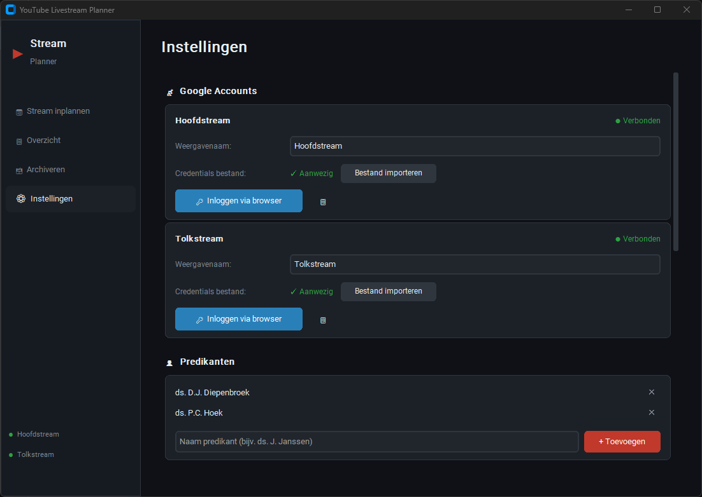
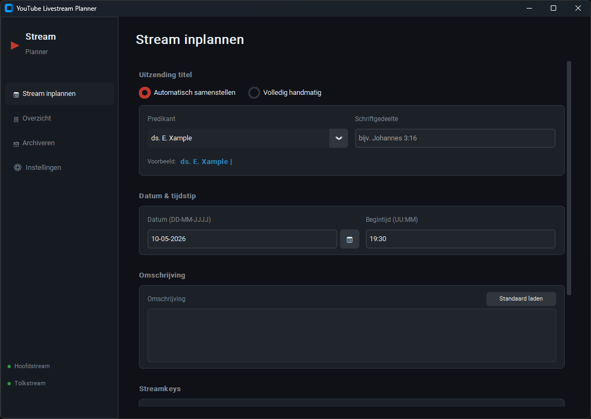
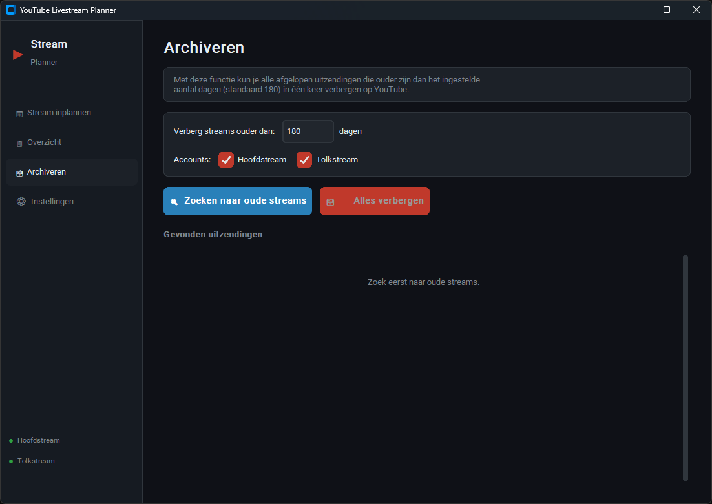

# YouTube Livestream Planner

Een Windows-applicatie voor het inplannen van YouTube livestreams voor twee accounts (hoofdstream & tolkstream).



---

## Versie-informatie

| Pakket | Versie |
|---|---|
| customtkinter | 5.2.2 |
| google-api-python-client | 2.195.0 |
| google-auth | 2.50.0 |
| google-auth-oauthlib | 1.3.1 |
| google-auth-httplib2 | 0.3.1 |
| tzdata | 2025.2 |
| PyInstaller | 6.20.0 |

**Vereist: Python 3.9 of hoger**

---

## Snel starten

### Optie A — Direct uitvoeren (geen .exe)
Dubbelklik op `start.bat`

### Optie B — Bouwen als .exe
Dubbelklik op `build.bat` → de .exe verschijnt in de map `dist\`

---

## Installatie (handmatig)

1. Zorg dat Python 3.9+ is geïnstalleerd → https://www.python.org/downloads/
2. Open een opdrachtprompt in deze map
3. Voer uit: `pip install -r requirements.txt`
4. Start: `python main.py`

---

## Google Cloud instellen

Voor elke YouTube-account heb je een apart `credentials.json` bestand nodig.
Herhaal deze stappen twee keer: voor de hoofdstream én de tolkstream.

### Stap 1: Google Cloud project aanmaken

1. Ga naar https://console.cloud.google.com/
2. Klik op het projectmenu → Nieuw project
3. Naam: bijv. `YouTube Planner Hoofdstream` → Maken

### Stap 2: YouTube Data API inschakelen

1. Ga naar API's en services → Bibliotheek
2. Zoek naar `YouTube Data API v3` → Inschakelen

### Stap 3: OAuth-toestemmingsscherm

1. Ga naar API's en services → OAuth-toestemmingsscherm
2. Kies Extern → Maken
3. Vul app-naam en e-mailadres in → Opslaan en doorgaan
4. Bij Testgebruikers: voeg het Google-account toe
5. Opslaan en doorgaan

### Stap 4: Credentials aanmaken

1. Ga naar API's en services → Referenties
2. Referenties maken → OAuth-client-ID
3. Toepassingstype: Desktopapp → Maken
4. JSON downloaden — dit is uw credentials.json

### Stap 5: Importeren in de applicatie

1. Open de applicatie → Instellingen
2. Klik bij het juiste account op Bestand importeren
3. Selecteer het JSON-bestand
4. Klik Inloggen via browser en volg de Google-loginprocedure

Herhaal voor het tweede account.

---

## Gebruik

### Stream inplannen



1. Ga naar Stream inplannen
2. Kies titelmodus: automatisch (predikant + schriftgedeelte) of handmatig
3. Stel datum en begintijd in
4. Voeg omschrijving toe of laad de standaardomschrijving
5. Selecteer de juiste streamkey per account
6. Schakel tolkstream aan of uit
7. Klik Stream inplannen

### Archiveren



1. Ga naar Archiveren
2. Stel het aantal dagen in (standaard 180)
3. Klik Zoeken naar oude streams
4. Controleer de lijst
5. Klik Alles verbergen

---

## Bestandsstructuur

```
YouTubePlanner/
├── main.py                   Startpunt
├── start.bat                 Snel starten (dubbelklik)
├── build.bat                 Bouwen als .exe (dubbelklik)
├── build.py                  Build script
├── requirements.txt          Python bibliotheken
├── src/
│   ├── app.py                Hoofdapplicatie
│   ├── settings.py           Instellingenbeheer
│   ├── youtube.py            YouTube API wrapper
│   ├── database.py           Lokale uitzendingendatabase
│   └── frames/
│       ├── plan_frame.py     Stream inplannen
│       ├── overview_frame.py Overzicht
│       ├── archive_frame.py  Archiveren
│       └── settings_frame.py Instellingen
└── data/                     Automatisch aangemaakt
    ├── settings.json
    ├── broadcasts.json
    ├── credentials_main.json
    ├── credentials_tolk.json
    ├── token_main.json
    └── token_tolk.json
```

---

## Veelgestelde vragen

**Blijft de streamkey hetzelfde?**
Ja. De applicatie koppelt de broadcast aan een bestaande streamkey.

**Kan ik de tolkstream per dienst uitschakelen?**
Ja, bij elke stream is er een schakelaar.

**Waar worden inloggegevens opgeslagen?**
Lokaal op uw computer in de data-map, nooit extern.

**Wat als ik een andere predikant wil toevoegen?**
Ga naar Instellingen → Predikanten → toevoegen.
